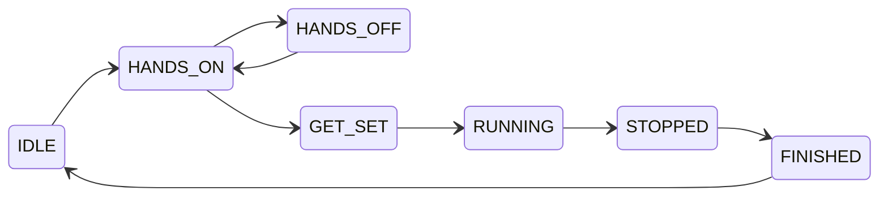

## Use of GAN Smart Timers & Smart Cubes via Web Bluetooth and React Native

This library is designed for easy interaction with GAN Smart Timers and Smart Cubes 
on the platforms that support [Web Bluetooth API](https://github.com/WebBluetoothCG/web-bluetooth/blob/main/implementation-status.md).

Nature of the GAN Smart Timer and Smart Cubes is event-driven, so this library is
depends on [RxJS](https://rxjs.dev/), and library API provide [Observable](https://rxjs.dev/guide/observable) 
where you can subscribe for events.

## Installation

Package `gan-web-bluetooth` is available in the npm registry:

[](https://badge.fury.io/js/gan-web-bluetooth)

```
$ npm install gan-web-bluetooth
```

## GAN Smart Timers

Supported GAN timer devices:
- GAN Smart Timer
- GAN Halo Smart Timer

Sample application how to use this library with GAN Smart Timer can be found here:
- https://github.com/afedotov/gan-timer-display
- Live version: [GAN Timer Display](https://afedotov.github.io/gan-timer-display/)

Sample TypeScript code:
```typescript
import { connectGanTimer, GanTimerState } from 'gan-web-bluetooth';

var conn = await connectGanTimer();

conn.events$.subscribe((timerEvent) => {
    switch (timerEvent.state) {
        case GanTimerState.RUNNING:
            console.log('Timer is started');
            break;
        case GanTimerState.STOPPED:
            console.log(`Timer is stopped, recorded time = ${timerEvent.recordedTime}`);
            break;
        default:
            console.log(`Timer changed state to ${GanTimerState[timerEvent.state]}`);
    }
});
```

You can read last times stored in the timer memory:
> Please note that you should not use `getRecordedTimes()` in polling fashion 
> to get currently displayed time. Timer and its bluetooth protocol does not designed for that.
```typescript
var recTimes = await conn.getRecordedTimes();
console.log(`Time on display = ${recTimes.displayTime}`);
recTimes.previousTimes.forEach((pt, i) => console.log(`Previous time ${i} = ${pt}`));
```

#### Possible timer states and their description:

State | Description
-|-
IDLE | Timer is reset and idle
HANDS_ON | Hands are placed on the timer
HANDS_OFF | Hands removed from the timer before grace delay expired
GET_SET | Grace delay is expired and timer is ready to start
RUNNING | Timer is running
STOPPED | Timer is stopped, this event includes recorded time
FINISHED | Move to this state immediately after STOPPED
DISCONNECT | Fired when timer is disconnected from bluetooth


#### Timer state diagram:



## GAN Smart Cubes

Supported Smart Cube devices:
- GAN Gen2 protocol smart cubes:
  - GAN Mini ui FreePlay
  - GAN12 ui FreePlay
  - GAN12 ui
  - GAN356 i Carry S
  - GAN356 i Carry
  - GAN356 i 3
  - Monster Go 3Ai
- MoYu AI 2023 (this cube uses GAN Gen2 protocol)
- GAN Gen3 protocol smart cubes:
  - GAN356 i Carry 2
- GAN Gen4 protocol smart cubes:
  - GAN12 ui Maglev
  - GAN14 ui FreePlay

Sample application how to use this library with GAN Smart Cubes can be found here:
- https://github.com/afedotov/gan-cube-sample
- Live version: [gan-cube-sample](https://afedotov.github.io/gan-cube-sample/)

Sample TypeScript code:
```typescript
import { connectGanCube } from 'gan-web-bluetooth';

var conn = await connectGanCube();

conn.events$.subscribe((event) => {
    if (event.type == "FACELETS") {
        console.log("Cube facelets state", event.facelets);
    } else if (event.type == "MOVE") {
        console.log("Cube move", event.move);
    }
});

await conn.sendCubeCommand({ type: "REQUEST_FACELETS" });
```

Since internal clock of the most GAN Smart Cubes is not ideally calibrated, they typically introduce 
noticeable time skew with host device clock. Best practice here is to record timestamps of move events 
during solve using both clocks - host device and cube. Then apply linear regression algorithm 
to fit cube timestamp values and get fairly measured elapsed time. This approach is invented 
and firstly implemented by **Chen Shuang** in the **csTimer**. This library also contains `cubeTimestampLinearFit()` 
function to accomplish such procedure. You can look into the mentioned sample application code for details, 
and this [Jupyter notebook](https://github.com/afedotov/scipy-notebooks/blob/main/ts-linregress.ipynb) for visualisation
of such approach.


## React Native

This fork adds a **transport seam** so the same protocol code drives a cube from
a phone as well as from a browser. The three protocol drivers, the encrypters and
the bit-level message view are untouched — they were already pure computation
over `Uint8Array`, and the only thing standing between them and React Native was
`navigator.bluetooth`.

```
    protocol drivers · encrypters · message view     ← unchanged, runs anywhere
    ────────────────────────────────────────────
    createGanCubeConnection(transport, …)            ← platform-free pipeline
    ────────────────────────────────────────────
    GanCubeTransport                                 ← the seam
    ────────────────────────────────────────────
    WebBluetoothTransport │ NativeBleTransport │ SimulatedTransport
```

`connectGanCube()` is unchanged in signature and behaviour; existing browser code
needs no edits.

### Connecting from React Native

Install [`react-native-ble-plx`](https://github.com/dotintent/react-native-ble-plx)
in your app — this library does not depend on it, and talks to it structurally so
any version works. **A development build is required**: BLE is a native module
and is not present in Expo Go.

```ts
import { BleManager } from 'react-native-ble-plx';
import { scanForGanCubes, connectGanCubeNative } from 'gan-web-bluetooth/native';

const manager = new BleManager();

const stopScan = scanForGanCubes(manager, async (result) => {
  if (!result.mac) return;            // see the note on iOS below
  stopScan();
  const conn = await connectGanCubeNative(result);
  conn.events$.subscribe(console.log);
  await conn.sendCubeCommand({ type: 'REQUEST_HARDWARE' });
  await conn.sendCubeCommand({ type: 'REQUEST_FACELETS' });
  await conn.sendCubeCommand({ type: 'REQUEST_BATTERY' });
});
```

From the returned `GanCubeConnection` onwards, nothing is platform-specific — it
is the same object `connectGanCube()` returns.

### The iOS MAC address constraint

GAN salts its encryption key with the cube's MAC address, so without one there is
no connection at all. Android exposes the MAC as `device.id`. **iOS does not**:
CoreBluetooth replaces it with a random per-app UUID and no API will ever return
the real address.

The only route on iOS is the advertisement, which GAN populates with the MAC and
which `react-native-ble-plx` surfaces as `device.manufacturerData` **on scan
results only**. A `Device` obtained any other way — from a stored id, from a
reconnect — generally has no manufacturer data.

**This constrains your UI, not just your networking code.** A flow that lists
cubes, discards the scan results and reconnects by id later cannot work on iOS.
Keep the scan result, or keep the `mac` it resolved. `scanForGanCubes` resolves
it at scan time for exactly this reason, and reports `mac: null` for a cube it
could not resolve so the UI can say so rather than failing at connect.

Pass a `NativeMacAddressProvider` to `connectGanCubeNative` to ask the user
directly as a last resort.

### Running without a cube

`gan-web-bluetooth/simulation` builds a cube that isn't there. It is a genuine
connection over a genuine Gen2 encrypter and driver, and every frame it emits is
bit-packed and AES-encrypted the way a cube sends it — nothing above the
transport is stubbed, so a demo, a test or an app driving it exercises the same
decrypt → parse → `events$` path that hardware does.

```ts
import { createSimulatedGanCube } from 'gan-web-bluetooth/simulation';

const cube = await createSimulatedGanCube();
cube.connection.events$.subscribe(console.log);

await cube.sendHardware();
await cube.sendFacelets();      // the cube's answer to REQUEST_FACELETS
await cube.turns("R U R' U'");  // four MOVE events, in order
```

`turn('F2')` emits **two** events, because the protocol has no half turn — the
vocabulary is six faces and two directions, and nothing else. Moves before the
first `sendFacelets()` are ignored, exactly as a real cube's are: serial numbers
mean nothing until the driver knows where the cube started.

It does not model cube state. `sendFacelets()` always reports solved, because
encoding an arbitrary position means a cube model, and that does not belong in a
BLE library.

It is a separate entry point so that an app shipping to a phone does not pull
frame builders it will never call into its bundle.

For a recorded session, drop to the transport directly:

```ts
import { SimulatedTransport, createGanCubeConnection, createEncrypter, createDriver } from 'gan-web-bluetooth';

const transport = new SimulatedTransport({ deviceMAC: 'AB:12:34:56:78:9A' });
const conn = await createGanCubeConnection(transport, createEncrypter(2, 'AB:12:34:56:78:9A'), createDriver(2));
await transport.replay(recordedFrames);   // frames as the cube sent them, encrypted
```

Run the suite with `npm test`.
